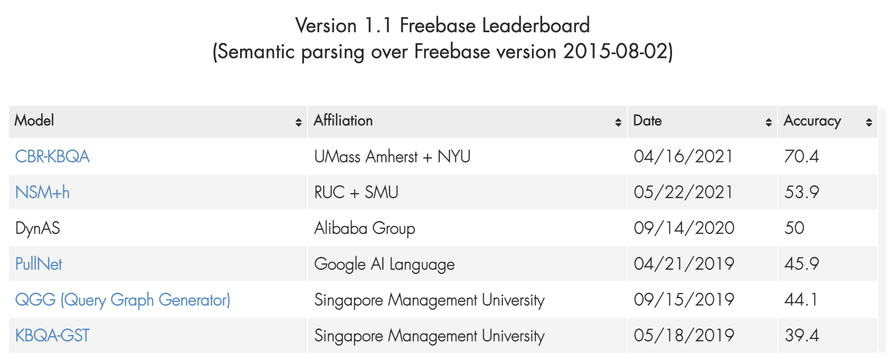

# WSDM2021_NSM (Neural State Machine for KBQA)
[](https://paperswithcode.com/sota/semantic-parsing-on-webquestionssp?p=improving-multi-hop-knowledge-base-question)

[](https://paperswithcode.com/sota/knowledge-base-question-answering-on?p=improving-multi-hop-knowledge-base-question)

This is our Pytorch implementation for the paper:

> Gaole He, Yunshi Lan, Jing Jiang, Wayne Xin Zhao and Ji-Rong Wen (2021). Improving Multi-hop Knowledge Base Question Answering by Learning Intermediate Supervision Signals. [paper](https://arxiv.org/abs/2101.03737), [slides](https://github.com/RichardHGL/WSDM2021_NSM/blob/main/presentation/wsdm_slides_ver2.pptx), [poster](https://github.com/RichardHGL/WSDM2021_NSM/blob/main/presentation/wsdm-poster.pdf), [video](https://vimeo.com/518921912), [CN blog](https://zhuanlan.zhihu.com/p/375233051). In WSDM'2021.


## Introduction
Multi-hop Knowledge Base Question Answering (KBQA) aims to find the answer entities that are multiple hops away in the Knowledge Base (KB) from the entities in the question. A major challenge is the lack of supervision signals at intermediate steps. Therefore, multi-hop KBQA algorithms can only receive the feedback from the final answer, which makes the learning unstable or ineffective. To address this challenge, we propose a novel teacher-student approach for the multi-hop KBQA task. 

## Requirements:

- Python 3.6
- Pytorch >= 1.3

## Dataset
We provide three processed datasets in : WebQuestionsSP (webqsp), Complex WebQuestions 1.1 (CWQ), and MetaQA.
* We follow [GraftNet](https://github.com/OceanskySun/GraftNet) to preprocess the datasets and construct question-specific graph.
* You can find instructions to obtain datasets used in this repo in [preprocessing](https://github.com/RichardHGL/WSDM2021_NSM/tree/main/preprocessing) folder
* You can also download preprocessed datasets from [google drive](https://drive.google.com/drive/folders/1qRXeuoL-ArQY7pJFnMpNnBu0G-cOz6xv?usp=sharing),
and unzip it into dataset folder, and use config --data_folder <data_path> to indicate it.

|Datasets | Train| Dev | Test | #entity| coverage |
|:---:|---:|---:|---:|---:|---:|
|MetaQA-1hop| 96,106 | 9,992 | 9,947 | 487.6 | 100%|
|MetaQA-2hop| 118,980 | 14,872 | 14,872 | 469.8 | 100%|
|MetaQA-3hop| 114,196 | 14,274 | 14,274 | 497.9| 99.0%|
|webqsp| 2,848 | 250 | 1,639 | 1,429.8 | 94.9%|
|CWQ| 27,639 | 3,519 | 3,531 | 1,305.8 | 79.3%|

Each dataset is organized with following structure:
- `data-name/`
  - `*.dep`: file contains question id, question text and dependency parsing (not used in our code);
  - `*_simple.json`: dataset file, every line describes a question and related question-specific graph; you can find how this file is generated with simplify_dataset.py. Mainly map entity, relation to global id in entities.txt and relations.txt.
  - `entities.txt`: file contains a list of entities;
  - `relations.txt`: file contains list of relations.
  - `vocab_new.txt`: vocab file.
  - `word_emb_300d.npy`: vocab related glove embeddings.

## Results
We provide result for : WebQuestionsSP (webqsp), Complex WebQuestions 1.1 (CWQ), and MetaQA.
* We follow [GraftNet](https://github.com/OceanskySun/GraftNet) to conduct evaluation. Baseline results come from original paper or related paper.

|Models | webqsp| MetaQA-1hop | MetaQA-2hop | MetaQA-3hop| CWQ |
|:---:|:---:|:---:|:---:|:---:|:---:|
|KV-Mem| 46.7 | 96.2 | 82.7 | 48.9 | 21.1|
|GraftNet| 66.4 | 97.0 | 94.8 |77.7 | 32.8|
|PullNet| 68.1 | 97.0 | **99.9** | 91.4| 45.9|
|SRN| - | 97.0 | 95.1 | 75.2 | - |
|EmbedKGQA| 66.6 | **97.5** | 98.8 | 94.8 | -|
|NSM| 68.7 | 97.1 | **99.9** | **98.9**| 47.6|
|NSM+p| 73.9 | 97.3 | **99.9** | **98.9** | 48.3|
|NSM+h| **74.3** | 97.2 | **99.9** | **98.9** | **48.8**|

The leaderboard result for NSM+h is **53.9**, and we get **rank 2** at 22th May 2021. (We are supposed to be ranked as top-1, if we submit around WSDM 2021 ddl 17th August 2020.)



## Training Instruction
Download preprocessed datasets from [google drive](https://drive.google.com/drive/folders/1qRXeuoL-ArQY7pJFnMpNnBu0G-cOz6xv?usp=sharing),
and unzip it into dataset folder, and use config --data_folder <data_path> to indicate it.
reported models for webqsp and CWQ dataset are available at [google drive](https://drive.google.com/file/d/15J02zSJTZUFyeBv-hk-2FII3qEoIVyr2/view?usp=sharing).
use following args to run the code. **make sure you created --checkpoint_dir, in the bash, it's supposed to have a 'checkpoint' folder in this repository.**

```
mkdir checkpoint
example commands: run_webqsp.sh, run_CWQ.sh, run_metaqa.sh
```
You can directly load trained ckpt and conduct fast evaluation with appending `--is_eval --load_experiment <ckpt_file>` to example commands.
Notice that `--load_experiment` config only accept **relative path** to `--checkpoint_dir`.

you can get detailed evaluation information about every question in test set, saved as file in `--checkpoint_dir`. For more details, you can refer to `NSM/train/evaluate_nsm.py`.

Important arguments:
```
--data_folder          Path to load dataset.
--checkpoint_dir       Path to save checkpoint and logs.
--num_step             Multi-hop reasoning steps, hyperparameters.
--entity_dim           Hidden size of reasoning module.
--eval_every           Number of interval epoches between evaluation.
--experiment_name      The name of log and ckpt. If not defined, it will be generated with timestamp.
--eps                  Accumulated probability to collect answers, used to generate answers and affect Precision, Recalll and F1 metric.
--use_self_loop        If set, add a self-loop edge to all graph nodes.
--use_inverse_relation If set, add reverse edges to graph.
--encode_type          If set, use type layer initialize entity embeddings. 
--load_experiment      Path to load trained ckpt, only relative path to --checkpoint_dir is acceptable. 
--is_eval              If set, code will run fast evaluation mode on test set with trained ckpt from --load_experiment option.
--reason_kb            If set, model will reason step by step. Otherwise, model may focus on all nodes on graph every step.
--load_teacher         Path to load teacher ckpt, only relative path to --checkpoint_dir is acceptable. 
```


## Acknowledgement
Any scientific publications that use our codes and datasets should cite the following paper as the reference:
```
@inproceedings{He-WSDM-2021,
    title = "Improving Multi-hop Knowledge Base Question Answering by Learning Intermediate Supervision Signals",
    author = {Gaole He and
              Yunshi Lan and
              Jing Jiang and
              Wayne Xin Zhao and
              Ji{-}Rong Wen},
    booktitle = {{WSDM}},
    year = {2021},
}
```
Nobody guarantees the correctness of the data, its suitability for any particular purpose, or the validity of results based on the use of the data set. The data set may be used for any research purposes under the following conditions:
* The user must acknowledge the use of the data set in publications resulting from the use of the data set.
* The user may not redistribute the data without separate permission.
* The user may not try to deanonymise the data.
* The user may not use this information for any commercial or revenue-bearing purposes without first obtaining permission from us.
